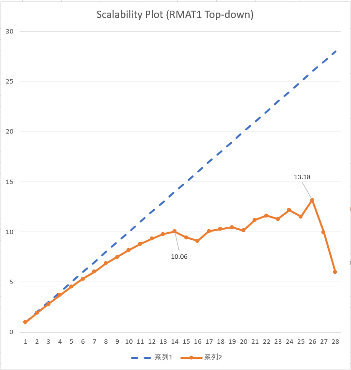

# ParallelBFS
Parallel Breadth First Search with OpenMP. Lab 2 of CS121 Parallel Computing 2021 Spring, taught at ShanghaiTech University.

## Build & Run
```sh
# Install dependencies
sudo apt install meson ninja-build python3
meson setup build --buildtype=release
meson compile -C build

cd bench

# Fetch benchmark
python3 fetch.py

# Run benchmark
python3 bench.py
```

## Benchmark
Config   | Value
-------- | -----
CPU      | Intel Xeon E5-2690 v4 @ 2.60GHz (14 Cores / 28 Threads)
Memory   | 252 GiB
Distro   | Ubuntu 18.04
Kernel   | 3.10.0
Compiler | Clang 11.0
Opt      | -O3
OpenMP   | libomp 5.0

### Overview

The first 4 benchmark are downloaded from [Stanford Network Analysis Project](https://snap.stanford.edu/snap). The 3 RMATs are generated with 100,000,000 vertices, 1000,000,000 edges and a, b, c parameters set to (0.3, 0.25, 0.25), (0.45, 0.25, 0.15), (0.57, 0.19, 0.19) respectively. All performance figures including standard deviation are reported in MTEPS, or million traversals of edges per seconds.

Benchmark       | Serial | Top-down / nt    | Hybrid / nt      | StdDev  | Speedup
--------------- | ------ | -------------    | ---------------- | ------- | ------
web-Stanford    | 153.29 | 469.47 / 13      | **490.02 / 4**   | 2.11    | 3.20
roadNet-CA      | 52.35  | **161.27 / 13**  | 153.48  / 12     | 1.67    | 3.08
com-Orkut       | 322.70 | **2365.44 / 25** | 2361.95 / 14     | 101.67  | 7.33
soc-LiveJournal | 91.19  | 692.73 / 27      | **1056.64 / 14** | 51.60   | 11.58
RMAT 1          | 249.24 | **4589.46 / 26** | 2931.37 / 25     | 1263.54 | 18.42
RMAT 2          | 103.09 | 1109.15 / 25     | **2004.01 / 24** | 1018.85 | 19.63
RMAT 3          | 429.86 | 1709.12 / 26     | **3528.19 / 25** | 1763.13 | 8.21

We choose the conventional serial top-down bfs as our baseline. For small graphs, the difference in performance between the top-down and bottom-up methods is not significant. For larger graphs, the hybrid method outperforms the top-down approach significantly, up to a factor of 2 with exception to RMAT 1. Speedup is larger than 14 for RMAT 2 and 3 because other optimizations are implemented besides introducing parallelism. For example, switching to bottom-up bfs under certain circumstances can actually reduce the number of edges visited, yielding superlinear speedup. All experiments are performed 32 times, and the average is taken. The best speed up we've obtained compared to the naive seral bfs is **19.63**.

### Scalability



The maximum performance is reached when the number of threads is set to 26 instead of 28. We hypothesize that this is due to background jobs/daemons running on the cluster. The effect of enabling hyperthreading is also quite interesting. Threads 14-27 are logical threads sharing the same physical core with threads 0-13. As depicted in the figure, performance increases smoothly and monotonically as thread count increases from 1 to 14 and then fluctuates. This is due to the 2 logical threads racing for the memory unit on the same physical core. The best scalability we obtained is **13.19**, which is very close to the physical core count.

## Optimizations

### Atomic bitmap
```C
u32 next = adj->c[j]
// Frequent cache miss due to random access by `parent[next]`
if (parent[next] = -1) {
  queue_push(q, next);
  parent[next] = v;
  distance[next] = distance[v] + 1;
}

// Reduces memory footprint by a factor of 32
// (vertex id is represented as u32)
if (!bitmap_test_set(visited, next) {
    // ...
}
```
Note that the asymptotic complexity for breadth-first search is O(E + V), which linear in the number of inputs. Therefore, considering that the memory access patterns for graph traversals are usually not sequential, performance will ultimately be bounded by memory throughput and cache misses. Using the `parent` array to mark whether a vertex is visited is not a good idea because a vertex takes 32 bits or 4 bytes. A single bit would be enough to store such information, reducing cache misses and memory footprint (random accesses) by a factor of 32.
```C
bool bitmap_test_set(bitmap *b, u32 n) {
  return !!((atomic_fetch_or(&b->map[index], 1 << offset) >> offset) & 1);
}
```
In the concurrent setting, accesses to bitmap must be performed atomically to prevent generating duplicate vertices in the next frontier. This is done using `atomic_fetch_or` from `<stdatomic.h>`. In theory, using `atomic_compare_and_swap` on the parent array should introduce fewer contentions compared to the atomic bitmap where 32 vertices share a single `atomic_uint`. In practice, contention rarely happens, and performance is limited by memory accesses instead.

### Prefix sum frontier allocation

In the serial version of bfs, we visit all nodes in the current frontier, iterating over all of its edges to check if there any vertices not yet visited. If there is one, the new vertex is pushed to the next frontier (queue). Simply adding `#pragma omp parallel for` to the outmost for loop will not work due to data race incrementing the queue size. A straightforward solution is to use a concurrent queue or increment the queue size atomically. Experiments show that this approach is far from ideal, especially when the graph is small. Instances like `web-Stanford` and `roadNet-CA` report a *slowdown* of 10x ~ 100x.

Another way is to allocate a sub frontier for each thread and merge the sub frontiers after each iteration is done. The only question that remains is: How much to allocate? Allocating a fixed size sub frontier may not work because new vertices may not necessarily be load balanced. Using a dynamically sized vector hurts performance, especially when the number of new vertices is small.

To tackle this problem, we exploit a special property of the CSR matrix. First, outgoing degrees of all vertices in the frontier are calculated and stored in a `degree` array. This can be calculated in O(1) * |F| time using `mat->r[v + 1] - mat->r[v]`. Then, we perform prefix sum on the `degree` array as starting index for new vertices discovered. The last value of the `degree` array is equal to the total number of edges from the frontier, or the maximum number of new vertices might be discovered. The next frontier is then allocated with a capacity of that value.

When inserting new vertices into the next frontier, the index is calculated by `degree[i] + j` where `degree[i]` is the starting index and `j` is the offset from the column vector bounded by `mat->r[v + 1] - mat->r[v]`. When discovering a vertex that has been already visited before, a sentinel value (-1) is inserted and later discarded in the merge process.

Merging once again makes use of the prefix sum operation. A `1` is set in the index array if a new vertex is found, a `0` if a sentinel is found otherwise. Computing prefix sum on the index array gives new indices with sentinels removed. Thus, all of the operations introduced, including allocation, insertion, and merging, can be done in parallel with no contention. This is the key to achieving parallelism in top-down bfs.

### Hybrid (top down / bottom up) traversal
An interesting observation was made by Beamer et al. in their paper "Direction-optimizing breadth-first search" that the conventional top-down bfs visits a lot of traversed peers and parents on graphs with a large degree and small diameter. Instead of traversing the frontier and checking whether a vertex is visited or not, which yields many failed attempts, they proposed to iterate over all the vertices and check if their parents are in the visited set. Another benefit of the bottom approach is that no atomics are needed. Do note, however, that this optimization is only applicable to undirected graphs. Applying such a technique to directed graphs would require calculating an inverse adjacency matrix, incurring high runtime and memory overhead.

A heuristic can be used to switch between bottom-up and top-down bfs to achieve the best of both worlds. We follow the authors' suggestion on parameter tuning. As per request of the professor, all graphs are treated as undirected even though some actually aren't (web-Stanford). Note some of the results might be inaccurate due to this requirement, though.

### OpenMP scheduling strategy tuning
We've found out that the `guided` strategy with no chunk size specified performs consistently well after experimenting with various scheduling strategies (`static`, `dynamic`, `guide`) and chunk size (1, 2, 4, 8, 16, auto) in almost all benchmarks. The `static` strategy is heavily load-imbalanced and scales poorly. The `dynamic` strategy, while having lower overhead and best load balancing, has poor cache locality, underperforming ~20% in most cases. We empirically set the scheduling strategy to `guided` for both top-down and bottom-up bfs.

## Credit
1. [Beamer, Scott, Krste Asanovic, and David Patterson. "Direction-optimizing breadth-first search."](https://downloads.hindawi.com/journals/sp/2013/702694.pdf)
2. [Hong, Sungpack, Tayo Oguntebi, and Kunle Olukotun. "Efficient parallel graph exploration on multi-core CPU and GPU."](https://ppl.stanford.edu/papers/pact11-hong.pdf)
3. [Leiserson, Charles E., and Tao B. Schardl. "A work-efficient parallel breadth-first search algorithm (or how to cope with the nondeterminism of reducers)."](http://supertech.csail.mit.edu/papers/pbfs.pdf)
4. [MIT 6.172 Performance Engineering of Software Systems, Lecture 22](https://www.youtube.com/watch?v=IT_4fw6gfJw&list=PLUl4u3cNGP63VIBQVWguXxZZi0566y7Wf&index=22)
6. [orancanoren/GPU-CPU-Parallel-Graph-Algorithms](https://github.com/orancanoren/GPU-CPU-Parallel-Graph-Algorithms)
5. [Stanford Network Analysis Project](https://snap.stanford.edu/snap)
7. [farkhor/PaRMAT](https://github.com/farkhor/PaRMAT)
